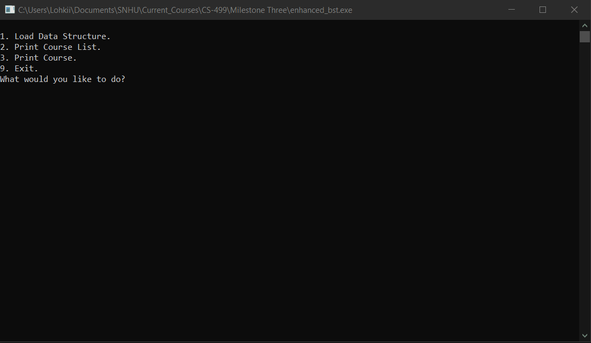

# Student Courses - Binary Search Tree Optimization

<p align="center">
  
</p>

## Description
This project manages student course data using a Binary Search Tree (BST) structure. The enhancement focused on optimizing the sorting and searching algorithms within the tree to improve performance and memory management compared to the original implementation.

## Enhancements
* **Algorithms & Data Structures**: Optimized tree traversal and sorting logic to maintain efficient search times.
* **Memory Management**: Refined pointer handling to prevent memory leaks and ensure stable execution.

## Libraries
* **Language**: C++
* **Standard Template Library (STL)**: `iostream`, `fstream`, `vector`, `algorithm`, `sstream`.

## How to Run
1. Ensure you have a C++ compiler installed (e.g., G++, Clang).
2. Download the `CS 300 ABCU Academic Advisory Programs Input.csv` file into the project folder.
3. Open your terminal in the project folder.
4. Compile the source code:
   ```bash
   g++ -o StudentBST main.cpp
   ./StudentBST
